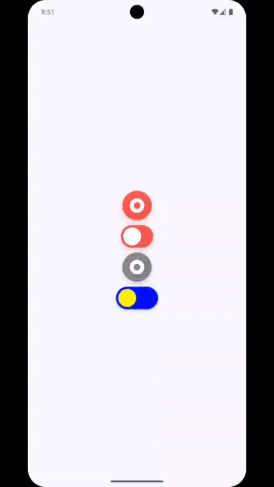

# Preview

<div align="center">
  
</div>
<br>

<h1 align="center">LCSwitch</h1>
<h3 align="center">A Circular and Linear toggle switch component built using Jetpack Compose. Inspired by <a href="https://dribbble.com/shots/5429846-Switcher-XLIV">Oleg Frolov</a></h3>
<br>

[](http://developer.android.com/index.html)
[](https://android-arsenal.com/api?level=21)

USAGE
-----
Just add [LCSwitch.kt](https://github.com/AmirSinaRZ/LCSwitch/blob/master/app/src/main/java/com/amirsinarz/lcswitch/LCSwitch.kt) file in your project .
Examples are in the [MainActivity.kt](https://github.com/AmirSinaRZ/LCSwitch/blob/master/app/src/main/java/com/amirsinarz/lcswitch/MainActivity.kt)

### Circular Switch:
```kotlin
@Composable
fun SwitcherC(
    modifier: Modifier = Modifier,
    width: Dp = 46.dp,
    height: Dp = 26.dp,
    checked: Boolean = true,
    onCheckedChange: ((Boolean) -> Unit)? = null,
    elevation: Dp = 4.dp,
    onColor: Color = Color(0xFF48ea8b),
    offColor: Color = Color(0xFFff4651),
    iconColor: Color = Color.White,
)
```
### Linear Switch
```kotlin
@Composable
fun SwitcherL(
    modifier: Modifier = Modifier,
    width: Dp = 46.dp,
    height: Dp = 26.dp,
    checked: Boolean = true,
    onCheckedChange: ((Boolean) -> Unit)? = null,
    elevation: Dp = 4.dp,
    onColor: Color = Color(0xFF48ea8b),
    offColor: Color = Color(0xFFff4651),
    iconColor: Color = Color.White,
) 
```
